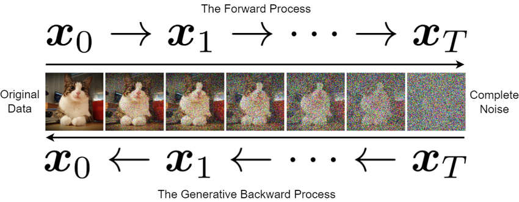

# Diffusion Models

This repository contains an implementation of a simple diffusion model on the MNIST data set.

## Theory of Diffusion Models

The theory of diffusion models is neatly described by [Higham, Higham and Grindrod](https://epubs.siam.org/doi/full/10.1137/23M1626232?af=R). In the following, we will adapt the notation used in the mentioned paper.

### Forward Process

Consider an image $\boldsymbol x_0 \in \mathbb R^d$. The *forward process* of a diffusion model works as follows.

The model generates a sequence of noisy images $\boldsymbol x_1, \boldsymbol x_2, \dots, \boldsymbol x_T$. Here, Gaussian noise is used. The update scheme is:

$$\boldsymbol x_t = \sqrt{1 - \beta_t}\boldsymbol x_{t-1}+\sqrt{\beta_t}\boldsymbol \varepsilon_t$$

Here, all $\boldsymbol \varepsilon_t$ are independent and standard normally distributed random variables. $\beta_1, \beta_2, \dots, \beta_T$ is the pre-defined variance schedule where $\beta_i \in (0, 1)$.

The transition density of going from $\boldsymbol x_{t-1}$ to $\boldsymbol x_{t}$ can be expressed as:

$$q(\boldsymbol x_t | \boldsymbol x_{t-1}) = \mathcal N(\boldsymbol x_t; \sqrt{1 - \beta_t}\boldsymbol x_{t-1}, \beta_t I)$$

Using $\alpha_t = 1 - \beta_t$, we can directly go from $\boldsymbol x_{0}$ to $\boldsymbol x_{t}$ by applying:

$$\boldsymbol x_t = \sqrt{\bar{\alpha}_t} \boldsymbol x_0 + \sqrt{1 - \bar{\alpha}_t} \bar {\boldsymbol{\varepsilon}}_t$$

Here it holds $\overline{\alpha_t} = \prod_{i=1}^{t}{\alpha_i}$ and $\bar {\boldsymbol{\varepsilon}}_t$ is again a standard normally distributed random variable. We can also write the transition density as:

$$q(\boldsymbol x_t | \boldsymbol x_0) = \mathcal N(\boldsymbol x_t; \sqrt{\bar{\alpha}_t}\boldsymbol x_{0}, (1 - \bar \alpha_t) I)$$

For more details, please see the [mentioned paper by Higham, Higham and Grindrod](https://epubs.siam.org/doi/full/10.1137/23M1626232?af=R).

### Backward process

The *backward process* deals with sampling new images using a trained diffusion model.

We consider the [chain rule of probability](https://en.wikipedia.org/wiki/Chain_rule_(probability)). The goal is to find the probability of $\boldsymbol x_{t-1}$ under the condition that $\boldsymbol x_{t}$ and $\boldsymbol x_{0}$ are already known, i.e. $q(\boldsymbol x_{t-1} | \boldsymbol x_t, \boldsymbol x_0)$. It holds:

$$q(\boldsymbol x_{t-1}|\boldsymbol x_t, \boldsymbol x_0) = \frac{q(\boldsymbol x_t|\boldsymbol x_{t-1}, \boldsymbol x_0) q(\boldsymbol x_{t-1}|\boldsymbol x_0)}{q(\boldsymbol x_t|\boldsymbol x_0)}$$

Because of the Markovian nature of the process and $\alpha_t = 1 - \beta_t$, we get:

$$q(\boldsymbol x_t|\boldsymbol x_{t-1}, \boldsymbol x_0) = q(\boldsymbol x_t|\boldsymbol x_{t-1}) = \mathcal N(\boldsymbol x_t; \sqrt{\alpha_t}\boldsymbol x_{t-1}, (1- \alpha_t)I)$$

Using the equations from above, we furthermore get:

$$q(\boldsymbol x_{t-1}|\boldsymbol x_t, \boldsymbol x_0) = \frac{\mathcal N(\boldsymbol x_t; \sqrt{\alpha_t}\boldsymbol x_{t-1}, (1- \alpha_t)I) \mathcal N(\boldsymbol x_{t-1}; \sqrt{\bar{\alpha}_{t-1}}\boldsymbol x_{0}, (1 - \bar \alpha_{t-1}) I)}{\mathcal N(\boldsymbol x_t; \sqrt{\bar{\alpha}_t}\boldsymbol x_{0}, (1 - \bar \alpha_t) I)}$$

It can be shown that

$$q(\boldsymbol x_{t-1}|\boldsymbol x_t, \boldsymbol x_0) = \mathcal N(\boldsymbol x_{t-1}; \boldsymbol \mu_q(\boldsymbol x_t, \boldsymbol x_0), \sigma^2_q(t)I)$$

holds for appropriate $\boldsymbol \mu_q(\boldsymbol x_t, \boldsymbol x_0)$ and $\sigma^2_q(t)$. We omit the full derivation here and once again refer to the mentioned paper. However, we end up with the following:

$$\boldsymbol \mu_q(\boldsymbol x_t, \boldsymbol x_0) = \frac 1 {\sqrt{\alpha_t}} \left(\boldsymbol x_t - \frac {1-\alpha_t}{\sqrt{1 - \bar \alpha_t}} \bar {\boldsymbol{\varepsilon}}_t \right)$$

$$\sigma_q^2(t) = \frac {(1 - \alpha_t)(1 - \bar \alpha_{t-1})}{1 - \bar \alpha_t}$$

The missing ingredient here is $\bar {\boldsymbol{\varepsilon_t}}$, the noise that drove us from $\boldsymbol x_0$ to $\boldsymbol x_t$. In the implementation, a *neural network* ${\boldsymbol{\varepsilon_{\boldsymbol \theta}}}$ is used to approximate this quantity. It will receive the noisy picture $\boldsymbol x_t$ and the corresponding time step $t$ as an input and is going to compute an approximation ${\boldsymbol{\varepsilon}}_{\boldsymbol \theta}(\boldsymbol x_t, t)$ for the noise $\bar {\boldsymbol{\varepsilon}}_t$.

Using the neural network and the definitions of $\boldsymbol \mu_q(\boldsymbol x_t, \boldsymbol x_0)$ and $\sigma_q^2(t)$, we end up with the following:

$$\boldsymbol x_{t-1} = \frac 1 {\sqrt{\alpha_t}} \left(\boldsymbol x_t - \frac {1-\alpha_t}{\sqrt{1 - \bar \alpha_t}} {\boldsymbol{\varepsilon}}_{\boldsymbol \theta}(\boldsymbol x_t, t) \right) + \sigma_q(t) \boldsymbol z$$.

Here, $\boldsymbol z$ is standard normally distributed. Using this, we can (try to) remove the noise of the noisy images. The goal is to generate new data.

Both, the *forward process* and the *backward process* can be summarized by the following picture.

    

## Used Libraries

This project uses [JAX](https://docs.jax.dev/en/latest/index.html), a library for array-oriented numerical computation, as well as its neural network extension [FLAX](https://flax.readthedocs.io/en/stable/).

    

## Implementation of the Diffusion Model

The implementation of the diffusion model can be found in the `diffusion_model.ipynb` notebook.
